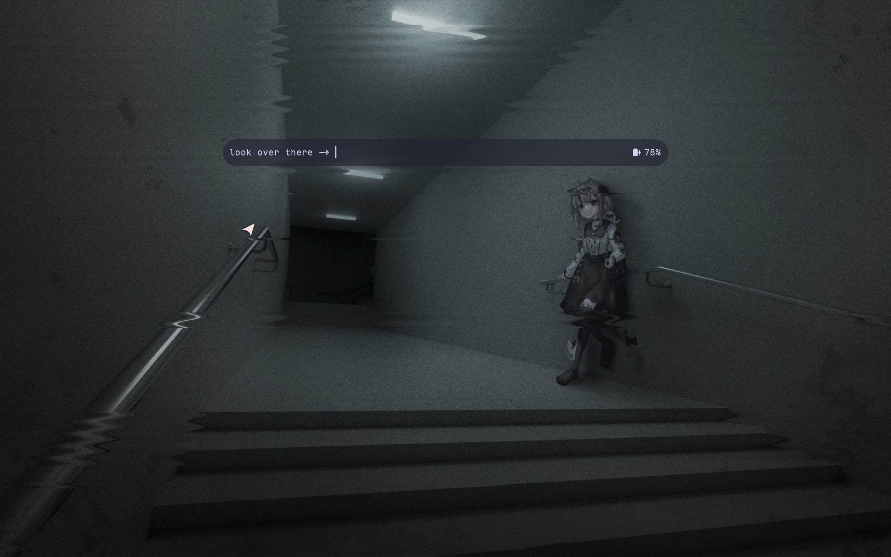
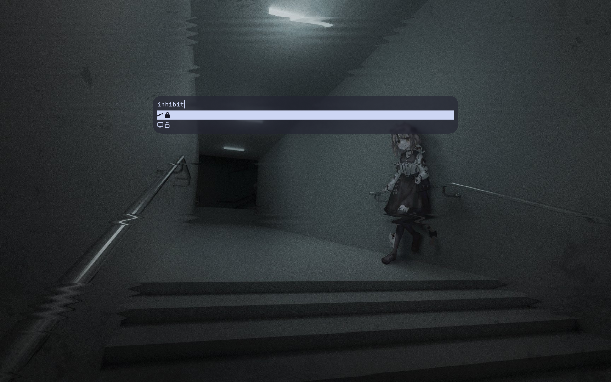
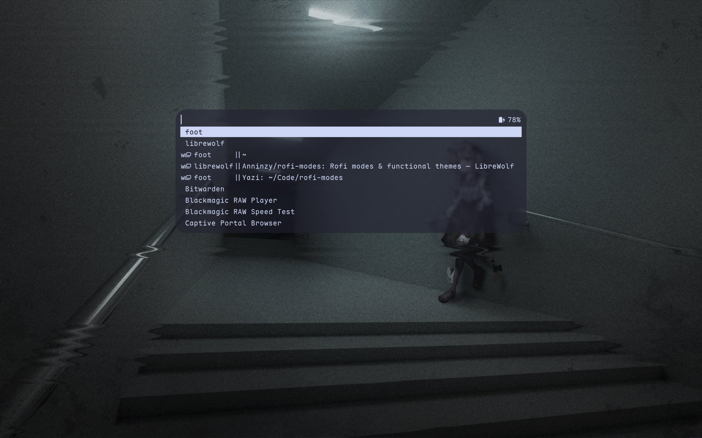

# Info

\
Currently displays battery status only\
\
Call rofi with the script `rofi.sh -show ...` instead\
\
Put the following into existing rofi theme

```
inputbar {
  children: [ ..., textbox-info ];
}

textbox-info {
  expand: false;
  content: ${INFO};
}
```

# Inhibit

\
Used as a rofi mode

```bash
rofi -modes "inhibit:PATH_TO_inhibit.sh" -show "inhibit"
```

`locked` symbol means that type of lock is active, vice versa\
\
`zzz` symbol stands for suspend lock, your idle management daemon can perform
any action except for suspending\
`monitor` symbol stands for idle lock, your idle management daemon will be
blocked from all actions\
Replace `status_*` with something more understandable than two nerdfont symbols
if needed

# Favorite

\

```bash
rofi -combi-modes "favorite:PATH_TO_favorite.sh" -show "combi"
```

Intended to be used in `combi`\
Ensure `favorite` is the 1st mode\
\
Modify the script to pin selected program
